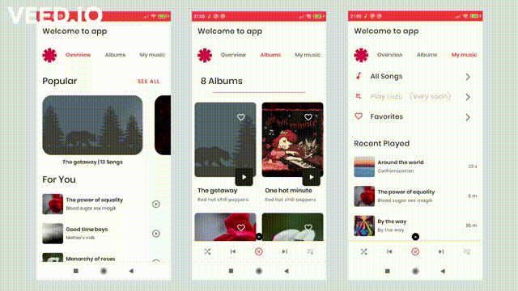

# RHCP Fan art application

This Android application is a music streaming of Red hot chili peppers artist. It is built around the [Universal Android Music Player](https://github.com/android/uamp).
The application uses the following features and apis for development:

 - Coroutines
 - MVVM Pattern
 - Koin for dependency injection
 - Navigation Components with Safe Args
 - Cache Strategy (local storage with Room)
 - ViewBinding
 - Material Design for UI

The project is Multimodule and each module has its own build.gradle file. All dependencies are managed by the [Dependency.kt](https://github.com/LMedez/RHCPFanArtAndroidApplication/blob/master/buildSrc/src/main/kotlin/Dependencies.kt)

