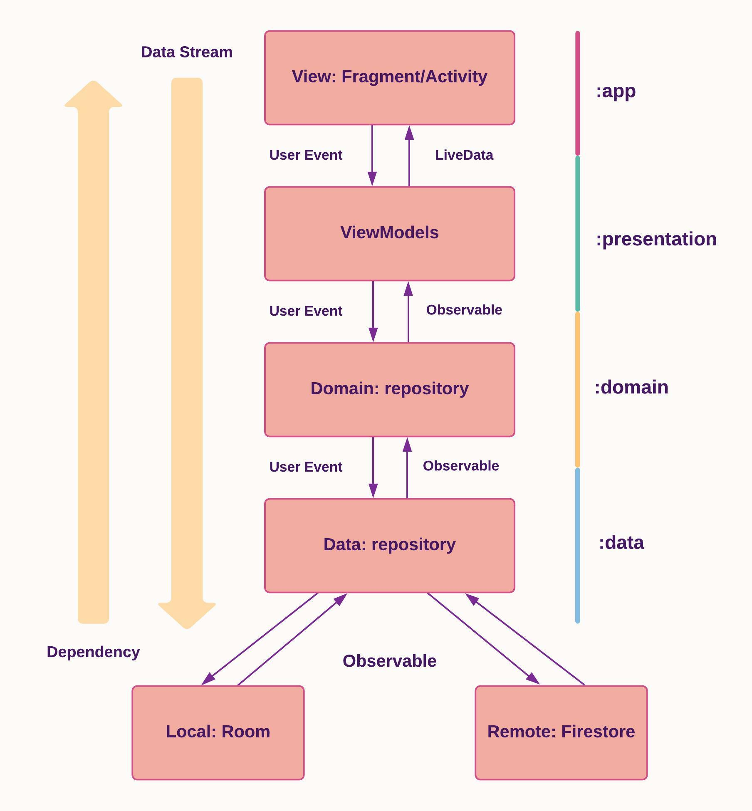

<h1 align="center">RHCP Fan art application</h1>
<p align="center">
This Android application is a music streaming of Red hot chili peppers artist. It is built around the <a href="https://github.com/android/uamp">Universal Android Music Player </a>
<br></br>

 
</p>

## Features
* 100% Kotlin
* MVVM architecture
* Reactive pattern
* Android Architecture Components
* Single activity pattern
* Dependency injection
* Testing (Upcoming)

## Tech Stacks
* [Koin](https://insert-koin.io/) - Dependency injection.
 * [Android Architecture Components](https://developer.android.com/topic/libraries/architecture) - A collections of libraries that help you design rebust, testable and      maintainable apps.
     * [Room](https://developer.android.com/training/data-storage/room) - Local persistence database.
     * [ViewModel](https://developer.android.com/reference/androidx/lifecycle/ViewModel) - UI related data holder, lifecycle aware.
     * [LiveData](https://developer.android.com/topic/libraries/architecture/livedata) - Observable data holder that notify views when underlying data changes.
     * [Data Binding](https://developer.android.com/topic/libraries/data-binding) - Declarative way to bind data to UI layout.
     * [View Binding](https://developer.android.com/topic/libraries/view-binding?hl=es-419) - Bind the view file to class controller
     * [Navigation component](https://developer.android.com/guide/navigation) - Fragment routing handler.
* [Flow](https://developer.android.com/kotlin/flow) Stream of value that returns from suspend function.
* [Coroutine](https://developer.android.com/kotlin/coroutines) Concurrency design pattern for asynchronous programming.
* [Glide](https://github.com/bumptech/glide) - Image loading.
* [Firestore](https://firebase.google.com/docs/firestore) - Remote data source

## Architectures




This follow Google recommended [Guide to app architecture](https://developer.android.com/jetpack/guide) to structure our architecture based on MVVM, reactive UI using LiveData/Flow observables with data binding and view binding.

* **View**: Activity/Fragment with UI-specific logics only.
* **ViewModel**: It keeps the logic away from View layer, provides data streams for UI and handle user interactions.
* **Model**: Repository pattern, data layers that provide interface to manipulate data from both the local and remote data sources. The local data sources will serve as [single source of truth](https://en.wikipedia.org/wiki/Single_source_of_truth).


## Package Structures

The project is Multimodule and each module has its own build.gradle file. All dependencies are managed by the [Dependency.kt](https://github.com/LMedez/RHCPFanArtAndroidApplication/blob/master/buildSrc/src/main/kotlin/Dependencies.kt)

```
RHCP Fan Art                            # Root Package
├── data                                # Data module
│   ├── com.luc.data                  
|      ├── di                           # DI modules
|      ├── firestore                    # Remote source data by Firebase Firestore
│      ├── local                        # Room database source data
|      └── repository                   # Repository for CRUD operations
|
├── domain                              # Domain module
│   ├── com.luc.domain            
|      ├── di                           # DI modules
|      ├── repository                   # Repository to use by use cases
|      └── usecases                     # Uses cases to manage data source
│
├── musicservice               
│   ├── com.luc.musicservice            
|      ├── di                           # DI modules for the music service
|      ├── extensions                   # Useful extensions for MediaMetadataCompat
|      ├── listeners                    # Listeners for music service events
|      ├── Datasource.kt                # Source of music data
|      ├── MusicNotificationManager.kt  # Manage all notification content 
|      ├── MusicService.kt              # Service for background music
|      └── MusicServiceConnection.kt    # Supporting class for connection with service
|             
├── presentation
|   ├── com.luc.presentation
│      ├── di                           # DI modules
│      └── viewmodel                    # ViewModels for user events
|
├── app                                 # App module
|   ├── com.luc.rhcpfanart
│      ├── di                           # DI modules
│      └── MainActivity.kt              # Start point of application
|
├── features                            # Feature package
|   ├── albumdetail                     # Albumdetail module
|   |  └── com.luc.albumdetail          
|   |     └── AlbumDetailFragment.kt    
|   |  
|   ├── home                            # Home module for home screen
|   |  └── com.luc.home
|   |     ├── albumfragment
|   |     ├── overviewfragment
|   |     ├── HomeFragment.kt
|   |     └── ViewPagerAdapter.kt
|   |     
|   ├── mediaplayer                      # Mediaplayer module for mediaplayer fragment that handles music events
|   |  └── com.luc.mediaplayer
|   |     ├── mediaplayerdetail
|   |     └── MediaPlayerFragment.kt
|   |      
|   ├── mymusic                          # mymusic module that manage the music of the user
|      └── com.luc.mymusic
|         ├── allsongsfragment
|         ├── favoritefragment
|         └── playlistfragment
|        
├── resources                           # Resource module for application resources such as animations,
|                                                              icons, colors, themes, items layout, etc.
|   ├── com.luc.resources
│      ├── adapter                
│      ├── animation                
│      ├── utils                
│      └── AttrExtensions.kt            
│     
├── common                              # Common module
    ├── com.luc.common
       ├── entities                     # Common entities for local database
       ├── model                        # Models of data for application
       └── Utils.kt                     # Commons utils

```
